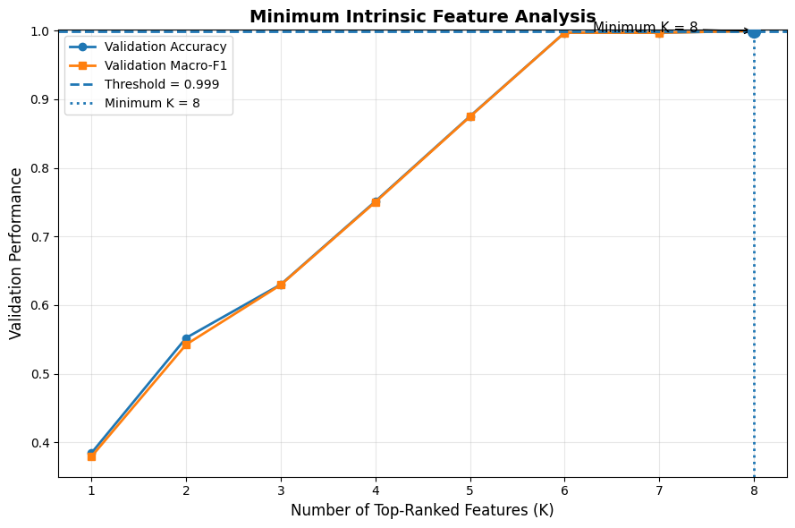
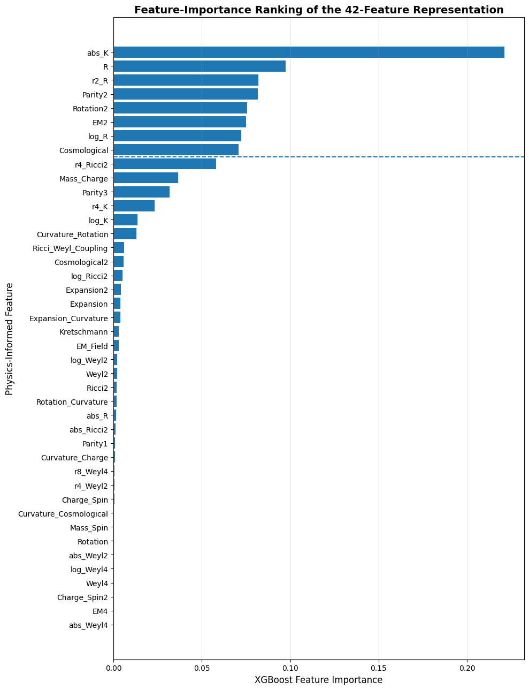
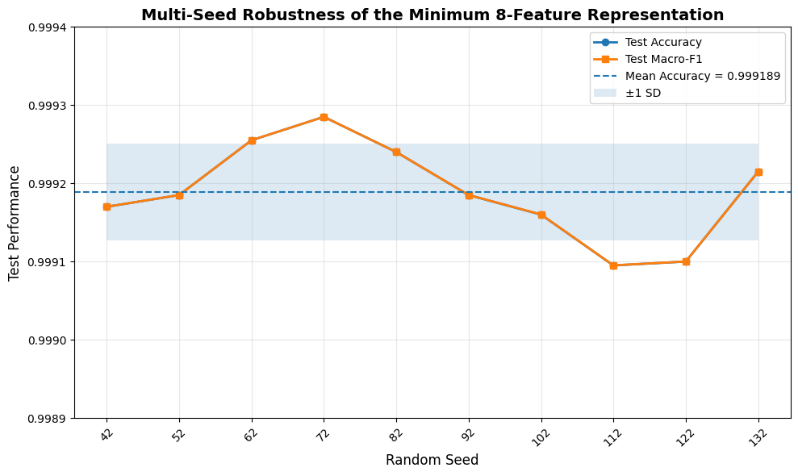
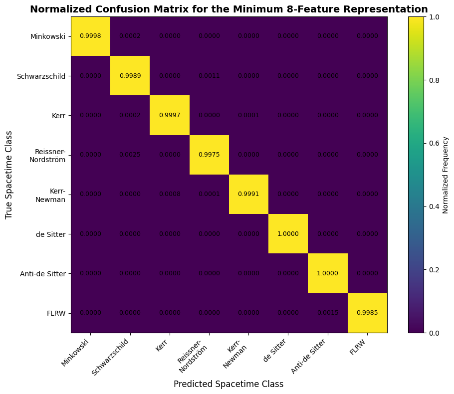
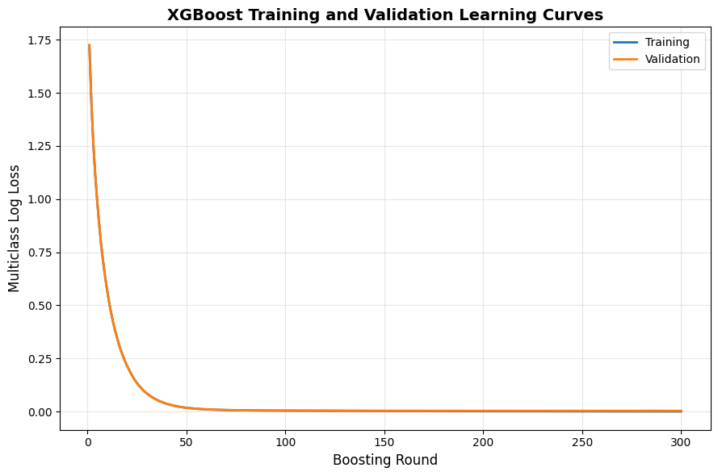
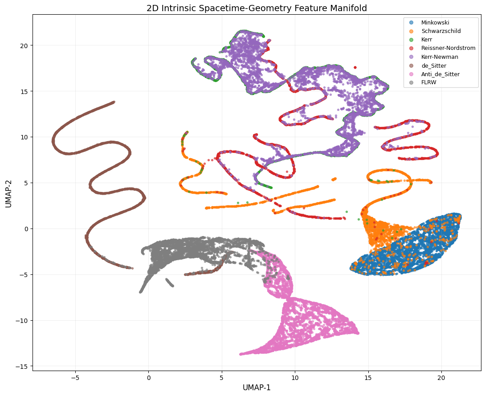
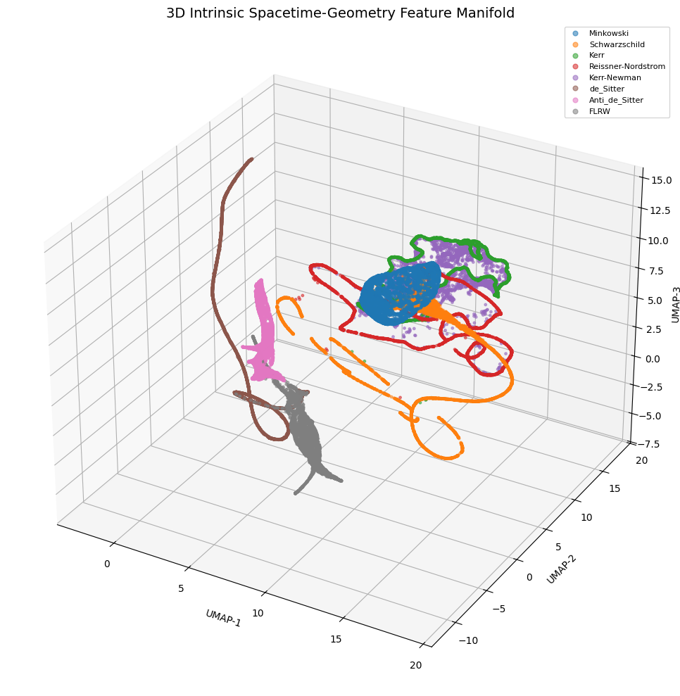
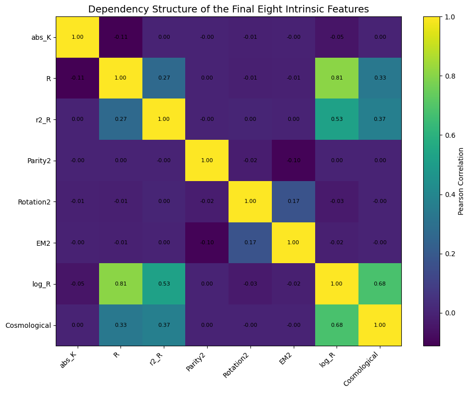

# Data-Driven Discovery of Minimal Intrinsic Curvature Dependencies in Spacetime Geometry

<p align="center">
  <b>Compact Intrinsic Geometric Representations of Spacetime</b>
</p>

<p align="center">
  A data-driven machine learning framework for identifying compact representations within a predefined space of intrinsic geometric descriptors.
</p>

<p align="center">
  
  
  
  
  
</p>

---

## Overview

This repository contains the computational framework and experimental results for the study:

**Data-Driven Discovery of Minimal Intrinsic Curvature Dependencies in Spacetime Geometry**

The project investigates whether a high-dimensional set of candidate geometric descriptors can be reduced to a compact subset while preserving the ability to distinguish among a selected collection of spacetime families.

The study uses machine learning as a **data-driven exploratory tool** for descriptor reduction. It does not replace Einstein's field equations, analytical spacetime solutions, or numerical relativity.

The central objective is to identify an empirically minimal representation **within the investigated descriptor space and selected spacetime families**.

---

## Key Features

- 42 candidate intrinsic geometric descriptors
- 2,000,000 synthetic spacetime samples
- 8 representative spacetime families
- XGBoost-based nonlinear classification
- Sequential top-\(K\) feature-selection analysis
- Empirical identification of an 8-feature representation
- Multi-seed robustness analysis
- Confusion-matrix evaluation
- Learning-curve analysis
- 2D and 3D UMAP visualization
- Correlation analysis of the final descriptor set
- Reproducible train/validation/test splitting
- Separation of physical parameters from ML input descriptors

---

## Spacetime Families

The dataset contains eight spacetime families:

| Class | Spacetime Family |
|------:|------------------|
| 0 | Minkowski |
| 1 | Schwarzschild |
| 2 | Kerr |
| 3 | Reissner–Nordström |
| 4 | Kerr–Newman |
| 5 | de Sitter |
| 6 | Anti-de Sitter |
| 7 | FLRW |

Each spacetime family contributes approximately **250,000 samples**, giving a total dataset size of approximately **2,000,000 samples**.

---

## Methodology

The computational workflow consists of the following stages:

<p align="center">
  <b>Analytical Spacetime Families</b><br>
  ↓<br>
  <b>Geometric Quantity Generation</b><br>
  ↓<br>
  <b>Intrinsic Descriptor Representation</b><br>
  ↓<br>
  <b>42 Candidate Geometric Descriptors</b><br>
  ↓<br>
  <b>Synthetic Dataset Construction</b><br>
  ↓<br>
  <b>Stratified Train / Validation / Test Split</b><br>
  ↓<br>
  <b>XGBoost Baseline</b><br>
  ↓<br>
  <b>Feature-Importance Ranking</b><br>
  ↓<br>
  <b>Sequential Top-K Feature Selection</b><br>
  ↓<br>
  <b>Minimum Empirical Feature Set</b><br>
  ↓<br>
  <b>Multi-Seed Robustness Analysis</b><br>
  ↓<br>
  <b>Compact Intrinsic Representation</b>
</p>

The **Intrinsic Descriptor Representation** defines the candidate geometric feature space before machine-learning-based reduction. The descriptor space contains curvature invariants, electromagnetic-related quantities, rotational descriptors, cosmological terms, and nonlinear combinations derived from the investigated spacetime families.

The resulting 42-dimensional descriptor space is subsequently evaluated using XGBoost to determine whether a substantially smaller subset can preserve the discriminative structure of the selected spacetime families.

---

## Intrinsic Descriptor Representation

The candidate descriptor space consists of 42 geometric descriptors constructed from curvature invariants, electromagnetic-related quantities, rotational terms, cosmological quantities, and nonlinear combinations.

### Candidate Descriptors

| # | Descriptor | # | Descriptor |
|---:|---|---:|---|
| 1 | `R` | 22 | `EM2` |
| 2 | `Ricci2` | 23 | `EM4` |
| 3 | `Kretschmann` | 24 | `Charge_Spin` |
| 4 | `Weyl2` | 25 | `Charge_Spin2` |
| 5 | `Weyl4` | 26 | `Rotation` |
| 6 | `r2_R` | 27 | `Rotation2` |
| 7 | `r4_Ricci2` | 28 | `Rotation_Curvature` |
| 8 | `r4_K` | 29 | `Mass_Charge` |
| 9 | `r4_Weyl2` | 30 | `Mass_Spin` |
| 10 | `r8_Weyl4` | 31 | `Cosmological` |
| 11 | `abs_R` | 32 | `Cosmological2` |
| 12 | `abs_Ricci2` | 33 | `Expansion` |
| 13 | `abs_K` | 34 | `Expansion2` |
| 14 | `abs_Weyl2` | 35 | `Expansion_Curvature` |
| 15 | `abs_Weyl4` | 36 | `Parity1` |
| 16 | `log_R` | 37 | `Parity2` |
| 17 | `log_Ricci2` | 38 | `Parity3` |
| 18 | `log_K` | 39 | `Curvature_Charge` |
| 19 | `log_Weyl2` | 40 | `Curvature_Rotation` |
| 20 | `log_Weyl4` | 41 | `Curvature_Cosmological` |
| 21 | `EM_Field` | 42 | `Ricci_Weyl_Coupling` |

---

## Dataset

The complete dataset contains:

| Property | Value |
|---|---:|
| Total samples | 2,000,000 |
| Spacetime families | 8 |
| Samples per family | 250,000 |
| Candidate descriptors | 42 |
| Training samples | 1,600,000 |
| Validation samples | 200,000 |
| Test samples | 200,000 |
| Noise level | 0.005 |
| Missing values | None |
| Infinite values | None |
| Duplicate samples | None |

The target spacetime family is kept separate from the descriptor matrix and is not used as an input feature.

Physical parameters are retained separately for scientific interpretation and are not treated as ordinary ML descriptors.

---

## Machine Learning Framework

The primary machine learning model is XGBoost, selected because it provides an efficient nonlinear model together with interpretable feature-importance measures.

The model is used for:

1. Baseline classification using all 42 descriptors.
2. Ranking descriptor importance.
3. Sequential top-(K) feature evaluation.
4. Identification of a compact descriptor representation.
5. Robustness testing across independent random seeds.

---

## Feature Reduction

The feature-reduction procedure ranks the 42 candidate descriptors according to their contribution to the XGBoost classification model.

The ranked descriptors are then evaluated sequentially:

[
K=1,2,\ldots,42.
]

For each (K), the first (K) ranked descriptors are used to train and evaluate a new classifier.

The objective is to identify the smallest descriptor subset that maintains the required validation performance.

The resulting representation is therefore described as an empirically minimal representation within the investigated descriptor space and selected spacetime families.

---

## Final Eight-Feature Representation

The final compact representation contains the following eight descriptors:

Rank| Descriptor
1| "abs_K"
2| "R"
3| "r2_R"
4| "Parity2"
5| "Rotation2"
6| "EM2"
7| "log_R"
8| "Cosmological"

These eight descriptors form the compact intrinsic representation investigated in the final analysis.

---

## Final Classification Performance

Using the final eight-feature representation:

Metric| Result
Test Accuracy| 0.999175
Macro-F1| 0.999175
Precision| 0.999176
Recall| 0.999175
Training Time| 24.66 s

The results indicate that the selected eight-feature representation retains very high classification consistency across the investigated spacetime families.

---

## Multi-Seed Robustness

To evaluate sensitivity to the random train/validation/test partition, the complete analysis was repeated using ten independent random seeds:

42, 52, 62, 72, 82,
92, 102, 112, 122, 132

Test Performance Across 10 Seeds

Metric| Mean ± SD
Accuracy| 0.999189 ± 0.000062
Macro-F1| 0.999189 ± 0.000062
Precision| 0.999190 ± 0.000062
Recall| 0.999189 ± 0.000062

## Accuracy Range

Minimum accuracy : 0.999095
Maximum accuracy : 0.999285
95% CI for mean  : [0.99915044, 0.99922756]

The small variation across independently generated data partitions provides an empirical robustness check for the compact representation.

---

## Results and Visualizations

The repository contains the following figures generated from the analysis.

Figure 1 — Minimum-K Analysis

Sequential evaluation of the top-(K) descriptors and identification of the compact feature representation.

---

Figure 2 — 42-Feature Importance Ranking

XGBoost-based feature-importance ranking across the complete 42-descriptor space.

---

Figure 3 — Multi-Seed Robustness

Test accuracy and performance variation across ten independent random seeds.

---

Figure 4 — Confusion Matrix

Confusion matrix obtained using the final eight-feature representation.

---

Figure 5 — XGBoost Learning Curve

Learning behavior and convergence of the XGBoost model.

---

Figure 6 — 2D Intrinsic Spacetime Manifold

Two-dimensional UMAP projection of the selected intrinsic descriptor representation.

---

Figure 7 — 3D Intrinsic Spacetime Manifold

Three-dimensional UMAP visualization of the intrinsic descriptor space.

---

Figure 8 — Eight-Feature Correlation Heatmap

Correlation structure among the eight selected descriptors.

---

## Software Requirements

The analysis was developed using Python and standard scientific machine-learning libraries.

Main Dependencies

Python >= 3.10

numpy
pandas
scikit-learn
xgboost
matplotlib
seaborn
umap-learn
scipy

---

## Repository Structure

GR-Spacetime/
│
├── README.md
│
├── data/
│   └── spacetime_dataset.csv
│
├── figures/
│   ├── Figure_1_Minimum_K_Analysis.png
│   ├── Figure_2_Feature_Importance_42.png
│   ├── Figure_3_Multi_Seed_Robustness.png
│   ├── Figure_4_Confusion_Matrix_8_Features.png
│   ├── Figure_5_XGBoost_Learning_Curve.png
│   ├── Figure_6_2D_Intrinsic_Spacetime_Manifold.png
│   ├── Figure_7_3D_Intrinsic_Spacetime_Manifold.png
│   └── Figure_8_8Feature_Correlation_Heatmap.png
│
├── notebooks/
│   └── analysis.ipynb
│
├── scripts/
│   ├── feature_selection.py
│   ├── multi_seed_analysis.py
│   ├── visualization.py
│   └── train_xgboost.py
│
└── requirements.txt

«Adjust the repository structure above if your actual filenames or folders differ.»

---

## Installation

Clone the repository:

git clone https://github.com/Mirza
cd GR-Spacetime

---

## Reproducibility

The experiments use explicitly defined random seeds for reproducible data partitioning and model evaluation.

The primary robustness analysis uses:

SEEDS = [42, 52, 62, 72, 82, 92, 102, 112, 122, 132]

The train/validation/test proportions are:

Training   : 80%
Validation : 10%
Test       : 10%

The feature-selection procedure is separated from the final evaluation to avoid using the test set for descriptor selection.

---

## Scientific Scope

This repository supports an exploratory computational investigation of intrinsic geometric descriptor redundancy.

The results should be interpreted within the following scope:

- The analysis is restricted to the investigated descriptor space.
- The analysis is restricted to the selected eight spacetime families.
- The identified eight-feature representation is empirical rather than a mathematical proof of completeness.
- Machine learning is used as a data-driven discovery and reduction mechanism.
- The approach does not replace Einstein's field equations.
- The results do not establish universal sufficiency of the selected descriptors for arbitrary spacetime geometries.
- Further analytical and physical validation is required to establish broader mathematical significance.

The central scientific question is therefore:

«Can a compact subset of intrinsic geometric descriptors preserve the discriminative structure of a predefined family of spacetime geometries?»

---

## Citation

If you use this repository or the associated methodology in academic work, please cite the corresponding research article:

@article{HussainSpacetimeGeometry,
  title   = {Data-Driven Discovery of Minimal Intrinsic Curvature Dependencies in Spacetime Geometry},
  author  = {Hussain, Mirza Mudassar and Bhatti, Zaeem-ul-Haq and Rahman, Jamshaid Ul},
  journal = {To be updated},
  year    = {2026},
  note    = {Computational research repository}
}

The BibTeX entry will be updated when the article receives its final publication information.

---

## Authors

Mirza Mudassar Hussain

PhD Research Scholar
Abdus Salam School of Mathematical Sciences
University of the Punjab, Lahore, Pakistan

Zaeem-ul-Haq Bhatti

Institute of Mathematics
University of the Punjab, Lahore, Pakistan

Jamshaid Ul Rahman
Abdus Salam School of Mathematical Sciences, Government College University, Lahore 54600, Pakistan
Machine Learning / Computational Research Collaboration

---

## Contributions

Contributions, scientific discussion, and reproducibility improvements are welcome.

Potential areas include:

- Analytical validation of geometric descriptors
- Additional spacetime families
- Alternative curvature-invariant constructions
- Independent feature-selection methods
- Explainable machine-learning analysis
- Symbolic validation
- Numerical-relativity validation
- Extension to gravitational-wave-related datasets

Please open an issue before making substantial methodological changes.

---

## License

This repository is intended for academic and research use.

A formal open-source license will be added to the repository as the project is finalized.

---

<p align="center">
  <b>Geometry → Descriptors → Feature Reduction → Compact Representation → Robustness</b>
</p>
```
:::
